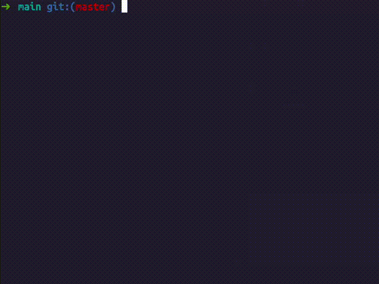

# cli-mini-ai

I was just tired of constantly switching between my terminal and browser to ask ChatGPT how to do stuff in the command line. It's a pain, right? So I made this dead simple CLI tool that lets you ask AI for help right in your terminal. No frills, just straight-up command generation and quick answers. Other solutions looked too complicated, so I made this one, just pure shell script.



## OS Compatibility

This tool is tested only on Ubuntu 22.04. MacOS support is experimental.

## Installation

> [!NOTE]  
> You will need an OpenAI API key to use this tool. During installation, you will be prompted to enter your API key. If you don't have one yet, you can create it by following the [OpenAI API Keys guide](https://platform.openai.com/docs/quickstart/create-and-export-an-api-key).

Install cli-mini-ai with a single command:

```bash
bash <(curl -sSL https://raw.githubusercontent.com/Clasyc/cli-mini-ai/v0.1.2/install.sh)
```

### This script will:

1. Install necessary dependencies, these include:
   - Installs `jq` for JSON parsing
   - Installs `xclip` for clipboard copying (for macOS, `pbcopy` is used)
2. Set up the cli-mini-ai scripts
3. Create configuration files
4. Add the tool to your PATH
5. Create an 'ai' alias for easy access

## Usage

After installation, simply use the `ai` command in your terminal:

```
ai
```

## Configuration

The installation script will guide you through setting up your OpenAI API key and choosing a system prompt. If you need to modify these later, edit the config file at:

```
~/.local/bin/cli-mini-ai/config
```

## Troubleshooting

If the 'ai' alias doesn't work immediately after installation, try:

1. Restarting your terminal
2. Manually sourcing your shell configuration file:
   ```
   source ~/.bashrc  # for Bash
   source ~/.zshrc   # for Zsh
   ```

## Uninstall

To uninstall cli-mini-ai, run the following command:

```bash
rm -rf ~/.local/bin/cli-mini-ai
```

This will remove all installed files. To complete the uninstallation, you should also remove the alias from your shell configuration file (`.bashrc` or `.zshrc`):

1. Open your shell configuration file:
   ```bash
   nano ~/.bashrc  # or ~/.zshrc if you're using Zsh
   ```

2. Find and remove the following line:
   ```bash
   alias ai='~/.local/bin/cli-mini-ai/alias.sh'
   ```

3. Save the file and exit the editor.

4. Reload your shell configuration:
   ```bash
   source ~/.bashrc  # or source ~/.zshrc for Zsh
   ```

After these steps, cli-mini-ai will be completely removed from your system.


## Contributing

Contributions are welcome! Please feel free to submit a Pull Request.

## License

[MIT License](LICENSE)